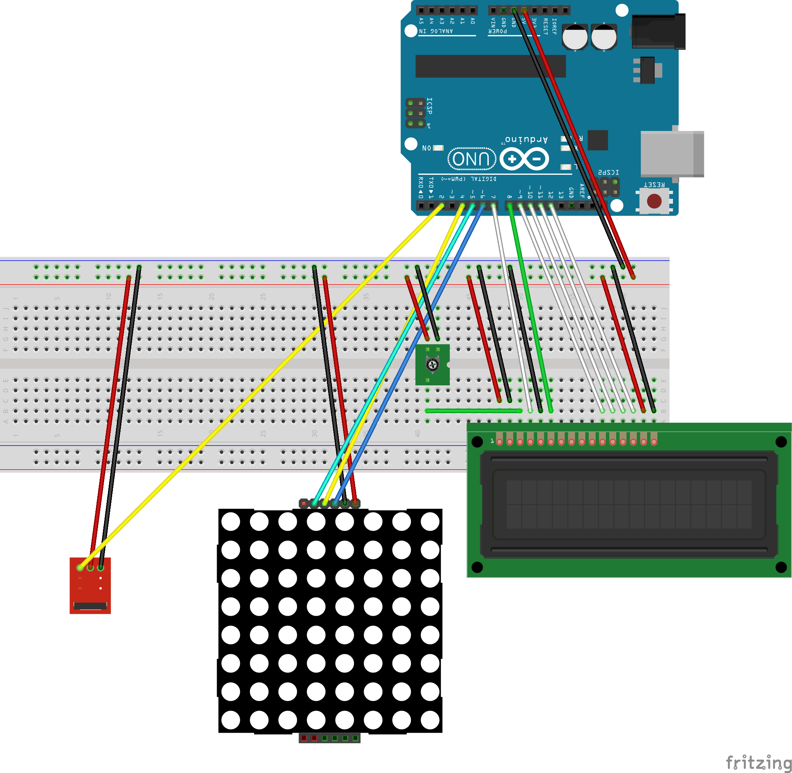

# Arduino Number Guessing Game
An Arduino recreation of a game where the player is given 6 chances to guess a number between 1 and 100 with each guess revealing if the number is higher or lower. This type of game can be written to learn a new programming languages syntax, for example the [Rust Guessing Game](https://doc.rust-lang.org/book/ch02-00-guessing-game-tutorial.html).

This project is built with these parts from the Elegoo Complete Starter Kit: 

- Arduino Uno R3
- Solderless Breadboard with M-M and F-M jumper wires
- MAX7129 LED Matrix
- LCD 1602 module
- Breakout IR receiver module
- IR Remote (NOTE: if you are not using Elegoo IR remote you may need to update IR codes  in `src/main.cpp`)

## Software
To compile the software side on Linux, install [platformio](https://platformio.org/install), if required make changes to `src/main.cpp` and:

```bash
cd arduino_number_guessing_game
# pio run -t compiledb # Run this if your code editor uses an LSP
pio run # Compile code without uploading to board
```

If this is successful you know the code compiles, after wiring can use `pio run -t upload` to flash the bytecode to the board.

## Hardware and Flashing Code to Board
Wiring schematic, might not be super clear, also refer to pin numbers defined in source code against your own wiring(e.g. IR receiver signal wire is defined as digital pin 2).



Once Arduino board is connected with USB, can flash new code: `cd arduino_number_guessing_game && pio run -t upload`. 

The USB connection can then be used to provide 5V power to the Arduino board and if the wiring is correct the project should run. Point the IR remote in direction of IR receiver and start guessing. If LCD screen isn't visible, then try turning the potentiometer to change contrast, otherwise check all wiring is correct.

